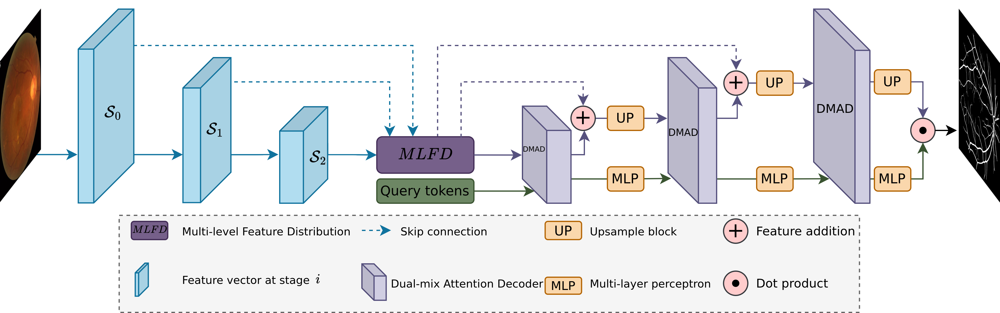
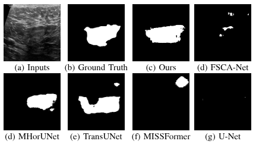

<h1 align="center">
  QTSeg 
  <br>
</h1>

<h4 align="center">Official code repository for paper "QTSeg: A Query Token-Based Architecture for Efficient 2D Medical Image Segmentation".</h4>

<p align="center">
<a href=""></a>
<a href=""></a>
<a href=""></a>
</p>
<div align="center">

[](https://www.python.org/downloads/)
[](https://pytorch.org/get-started/locally/)
[](https://developer.nvidia.com/cuda-toolkit-archive)
[](https://colab.research.google.com/github/tpnam0901/QTSeg/blob/dev/QTSeg.ipynb)
[](https://arxiv.org/abs/2412.17241)

</div>

<p align="center">
  <a href="#abstract">Abstract</a> •
  <a href="#how-to-use">How To Use</a> •
  <a href="#download">Download</a> •
  <a href="#license">License</a> •
  <a href="#citation">Citation</a> •
  <a href="#references">References</a> •
</p>

## Abstract
> Medical image segmentation is crucial in assisting medical doctors in making diagnoses and enabling accurate automatic diagnosis. While advanced convolutional neural networks (CNNs) excel in segmenting regions of interest with pixel-level precision, they often struggle with long-range dependencies, which is crucial for enhancing model performance. Conversely, transformer architectures leverage attention mechanisms to excel in handling long-range dependencies. However, the computational complexity of transformers grows quadratically, posing resource-intensive challenges, especially with high-resolution medical images. Recent research aims to combine CNN and transformer architectures to mitigate their drawbacks and enhance performance while keeping resource demands low. Nevertheless, existing approaches have not fully leveraged the strengths of both architectures to achieve high accuracy with low computational requirements. To address this gap, we propose an efficient query tokens hybrid architecture for 2D medical image segmentation (QTSeg) that leverages CNN as the image encoder and transformer as the mask decoder. By incorporating the attention mechanism in the mask decoder, QTSeg effectively learns pyramid features generated by the CNN. A multi-query mask decoder (MQM Decoder) is utilized to enhance mask generation by integrating the query token with pyramid features in the mask decoder. Additionally, a multi-level feature fusion (MLFF) is included between the encoder and decoder to merge features from different stages. Experimental results demonstrate that QTSeg outperforms state-of-the-art methods across all metrics with much lower computational demands than the baseline and the existing methods.

<p align="center">
  
</p>

## How To Use

#### Dependencies

- OS Requirements:
    - Linux (Ubuntu/Debian) (Windows is not officially supported)
    - CUDA >=11.6
    - cuDNN 8.2.4
    - Python >= 3.8
    - PyTorch >=1.12.1
- Our environment:
    - OS: Debian 12 (bookworm)
    - GPU: NVIDIA 3090 / NVIDIA 3080ti
    - CUDA 11.8
    - cuDNN 8.9.7
    - Python 3.8.16
    - PyTorch 2.0.1
    
- Clone this repository 
```bash
git clone https://github.com/tpnam0901/QTSeg.git
cd qtseg
```
- Create a conda environment and install requirements
```bash
conda create -n qtseg python=3.8.16 -y
conda activate qtseg 
conda install pytorch==2.0.1 torchvision==0.15.2 torchaudio==2.0.2 pytorch-cuda=11.8 -c pytorch -c nvidia
pip install -r requirements.txt
```
or with conda environment
```bash
conda env create -f environment.yml
```

- Note: If you met the error `np.bool` in the imgaug library. The simplest way to fix this is to modify `np.bool` to `bool` in the imgaug library `eg. miniconda3/envs/qtseg/lib/python3.8/site-packages/imgaug/augmenters/meta.py - line 305`. This issue may be fixed in the future related to [issue](https://github.com/aleju/imgaug/pull/857). Another way is to downgrade the numpy version to 1.19.5. However, this may cause some errors in other libraries.

#### Preprocessing dataset
##### Skin lesion segmentation (ISIC)
- Dataset used in this project is [ISIC2016](https://challenge.isic-archive.com/data/) versions.

- After downloading the dataset, you need to extract it and put it in the data folder. Please rename the folder containing input data to inputs and the folder containing label data to targets. The folder structure should be as follows:
```
# Note: do not change the filename of the images
- working/dataset/ISIC2016 # or any path you want
    - train
        - inputs # refer to the input images
            - *.jpg
        - targets # refer to the mask images
            - *.png
    - val
        - inputs
            - *.jpg
        - targets
            - *.png
```

##### Breast Ultrasound Images Dataset (BUSI)
- Dataset used in this project is [BUSI](https://scholar.cu.edu.eg/?q=afahmy/pages/dataset) - [link_backup](https://www.kaggle.com/datasets/aryashah2k/breast-ultrasound-images-dataset).

- After downloading the dataset, you need to extract the dataset and put it in the data folder. The folder structure should be as follows:
```
# Note: do not change the filename of the images
- working/dataset/BUSI # or any path you want
    - benign
        - *.png
    - malignant
        - *.png
    - normal
        - *.png
```
- First, before splitting the dataset into 5 folds, we need to merge any sample that has more than 1 label file. This can be done by running the following command:
```bash
cd src/tools && python busi_01_combine_masks.py --data_root ../working/dataset/BUSI/
```
- Then, we can split the dataset into 5 folds by running the following command:
```bash
cd src/tools && python busi_02_split_folds.py --data_root ../working/dataset/BUSI/
```
- The dataset is sorted by the names of the images before splitting. The samples are chosen by slicing the array with a size of the number of samples in each fold. So, the same fold index will have the same samples in different runs. After the process, the dataset will be split into 5 folds and saved in the `working/dataset/BUSI/folds` folder as used in the paper.

##### BKAI-IGH NeoPolyp-Small
- Dataset used in this project is [BKAI-IGH NeoPolyp-Small](https://github.com/GivralNguyen/BKAI-IGH-Neopolyp-Segmentation).

- After downloading the dataset, you need to extract the dataset and put it in the data folder. The folder structure should be as follows:
```
# Note: do not change the filename of the images
- working/dataset/BKAI # or any path you want
    - sample_submission.csv
    - test/test
        - *.jpeg
    - train/train
        - *.jpeg
    - train_gt/train_gt
        - *.jpeg
```
- First, before splitting the dataset into 5 folds, we need to convert multi-class masks to binary masks. This can be done by running the following command:
```bash
# this will create 2 new folders named train_gt_binary and train_gt_multiclass in train_gt/train_gt folder
cd src/tools && python bkai_01_preprocess_mask.py --data_root ../working/dataset/BKAI/
```
- Then, we can split the dataset into 5 folds by running the following command:
```bash
# this will create 2 new folders named folds_binary and folds_multiclass in the dataset folder
cd src/tools && python bkai_02_split_folds.py --data_root ../working/dataset/BKAI/
```
- The dataset is sorted by the names of the images before splitting. The samples are chosen by slicing the array with a size of the number of samples in each fold. So, the same fold index will have the same samples in different runs. After the process, the dataset will be split into 5 folds and saved in the `working/dataset/BUSI/folds` folder as used in the paper.

#### Configuration & Training

- Before starting training, you need to download pre-trained models from [fpn-nano.pth](https://github.com/tpnam0901/QTSeg/releases/download/v0.1.0/fpn-nano.pth) and put them in the `src/networks/pretrained` folder. In case the link is broken, you can download the pre-trained models from the assets in the [release page](https://github.com/tpnam0901/QTSeg/releases/tag/v0.1.0). The structure of your folder should be as follows:
```bash
src
├── networks
    ├── pretrained
        ├── fpn-nano.pth
```

- The configuration file is located in the `configs` folder. You can modify the configuration file to suit your needs. For example, you can change the dataset path, the number of classes, the batch size, the number of epochs, etc.

- Train ISIC dataset
```bash
cd src && python train.py -cfg configs/ISIC.py
```

- Train BUSI dataset
```bash
cd src && python train.py -cfg configs/BUSI.py
```

- Train BKAI dataset
```bash
cd src && python train.py -cfg configs/BKAI.py
```

- You can visualize the training process by running the following command:
```bash
# This is the checkpoint folder that contains `mlruns` folder
cd src/working/checkpoint/QTSeg/<DATASET_NAME>/ && mlflow server -p 5000
```

#### Evaluation & Inference

- After training, you will have the checkpoints saved in the `working/checkpoints` folder which contains the model weights in the `.pt` format and the `.json` file containing the configuration of the model. You can evaluate the model by running the following command:
```bash
# For all checkpoints
cd src && python eval.py -cfg working/checkpoint/QTSeg/20241120-223413/cfg.json
or
# For specific checkpoint
cd src && python eval.py -cfg working/checkpoint/QTSeg/20241120-223413/cfg.json --ckpt working/checkpoint/QTSeg/20241120-223413/weight_best_iou.pt 
```

- For inference, you can run the following command:
```bash
# For all checkpoints
cd src && python infer.py -cfg working/checkpoint/QTSeg/20241120-223413/cfg.json --input_dir path/to/input_dir --output_dir path/to/output_dir
# For specific checkpoint
cd src && python infer.py -cfg working/checkpoint/QTSeg/20241120-223413/cfg.json --ckpt working/checkpoint/QTSeg/20241120-223413/weight_best_iou.pt --input_dir path/to/input_dir --output_dir path/to/output_dir
```

- Some results:
<p align="center">
    
    
</p>
<p align="center">

</p>
<p align="center">
    
    
</p>

## Citation
```bibtex
@misc{tran2024qtsegquerytokenbasedarchitecture,
      title={QTSeg: A Query Token-Based Architecture for Efficient 2D Medical Image Segmentation}, 
      author={Phuong-Nam Tran and Nhat Truong Pham and Duc Ngoc Minh Dang and Eui-Nam Huh and Choong Seon Hong},
      year={2024},
      eprint={2412.17241},
      archivePrefix={arXiv},
      primaryClass={cs.CV},
      url={https://arxiv.org/abs/2412.17241}, 
}
```
## References

---

> GitHub [@tpnam0901](https://github.com/tpnam0901) &nbsp;&middot;&nbsp;
